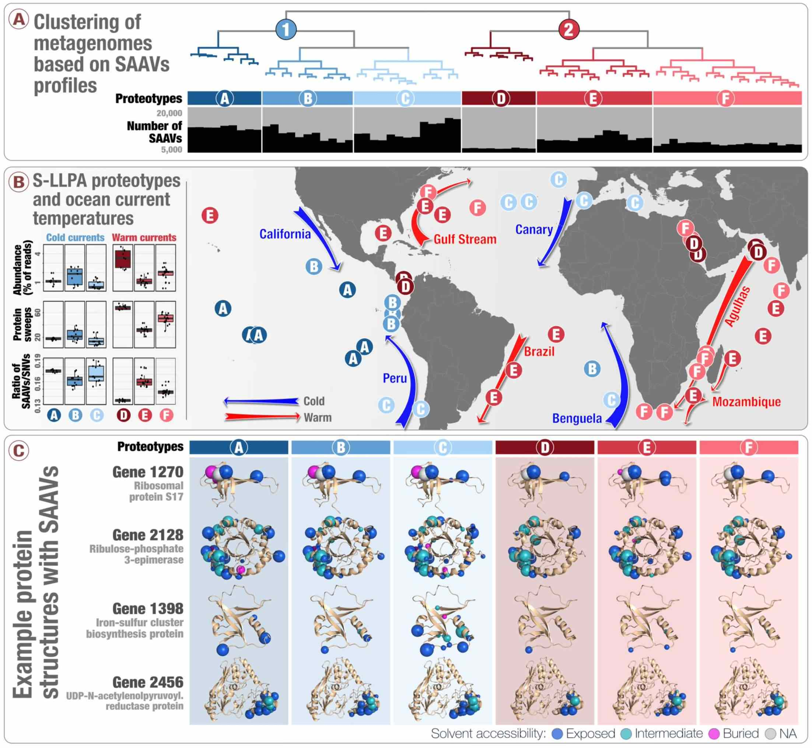
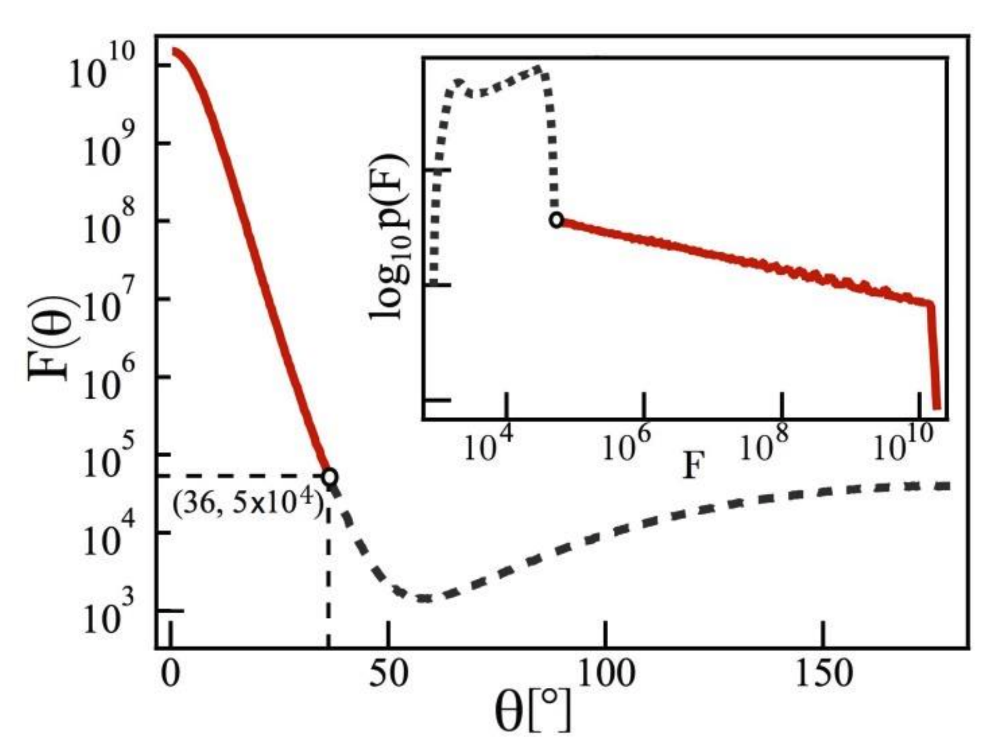
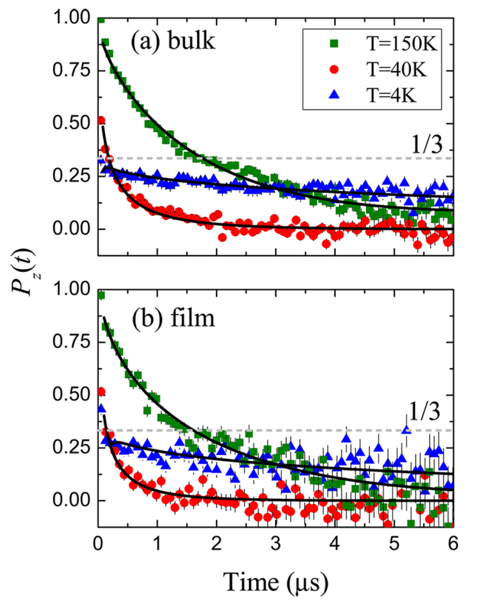
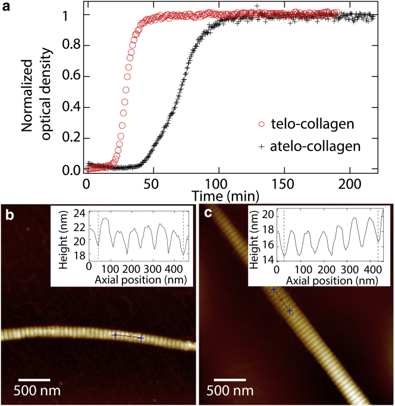

<a href="#2019">2019</a><a href="#2017">2017</a><a href="#2016">2016</a>

<a name="2019">&nbsp;</a>
<h1>2019</h1>

    <h3><a href=" https://doi.org/10.7554/eLife.46497" target="_new">Single-amino acid variants reveal evolutionary processes that shape the biogeography of a global SAR11 subclade</a></h3>
    Delmont TO☯, Kiefl E☯, Kilinc O, Esen ÖC, Uysal I, Rappé MS, Giovannoni S, Eren AM
    ☯Co-first authors
    

    

    
    

    

    - Introduces <a href="http://merenlab.org/2015/07/20/analyzing-variability/#an-intro-to-single-nucleotidecodonamino-acid-variation" target="_blank">'single-amino acid variants'</a> (SAAVs) and demonstrates <b>the use of SAAVs to tease apart evolutionary processes that shape the biogeography and genomic heterogeneity within a SAR11 population</b> through metagenomics. -  A first attempt to link population genetics and the predicted protein structures to explore <i>in silico</i> <b>the intersection beetween protein biochemistry and evolutionary processes</b> acting on an environmental microbe. -  An application of <a href="https://peerj.com/articles/4320/" target="_blank">metapangenomics</a> to define <b>subclades of SAR11 based on gene content and ecology</b>. -  Reproducible bioinformatics workflow is <a href="http://merenlab.org/data/sar11-saavs/" target="_blank">here</a>. <a href="https://doi.org/10.7554/eLife.46497.040" target="_blank">Reviewer criticism</a> and <a href="https://doi.org/10.7554/eLife.46497.041" target="_blank">our responses</a> are also available.
    

    

    <b>eLife</b>, 8:e46497.

<a name="2017">&nbsp;</a>
<h1>2017</h1>

    <h3><a href=" https://doi.org/10.1021/acs.jpcc.7b08691" target="_new">Evaluation of surface-enhanced Raman spectroscopy substrates from single-molecule statistics</a></h3>
    Kiefl E, Kiefl RF, dos Santos DP, Brolo AG
    

    

    
    

    

    - Demonstrates power-law statistics of surface-ehanced Raman spectroscopy (SERS) hotspots can be used to <b>assess the quality of SERS substrates</b>. -  Extends the theory of truncated Pareto-distributed single-molecule SERS statistics to multi-hotspot substrates. 
    

    

    <b>The Journal of Physical Chemistry C</b>, 121(45):25487-25493.

<a name="2016">&nbsp;</a>
<h1>2016</h1>

    <h3><a href=" https://doi.org/10.1021/acsnano.6b01817" target="_new">Robust Magnetic Properties of a Sublimable Single-Molecule Magnet</a></h3>
    Kiefl E, Mannini M, Bernot K, Yi X, Amato A, Leviant T, Magnani A, Prokscha T, Suter A, Sessoli R, Salman Z
    

    

    
    

    

    - Demonstrates an equivalence in the magnetic properties between bulk and nanofilm configurations of a single-molecule magnet (SMM) using <b>muon spin spectroscopy</b> -  Discovers a rare instance in which a single molecule magnet maintains its chemical structure and magnetic properties when sublimated into nanofilm, <b>an important precursor for using SMMs for information storage</b>.
    

    

    <b>ACS Nano</b>, 10(6):5663-5669.

    <h3><a href=" https://doi.org/10.1016/j.bpj.2016.10.039" target="_new">Intact telopeptides enhance interactions between collagens</a></h3>
    Shayegan M, Altindal T, Kiefl E, Forde NR
    

    

    
    

    

    - Uses <b>optical tweezers-based microrheology</b> to quantify the <b>viscoelasticity</b> of triple-helical collagen molecules, with and without non-helical flanking regions called telopeptides, which are known to be <b>critical for self-assembly</b>. -  This work suggests that <b>telopeptides facilitate transient intermolecular interactions between collagen proteins</b>
    

    

    <b>Biophysical journal</b>, 111(11):2404-2416.

